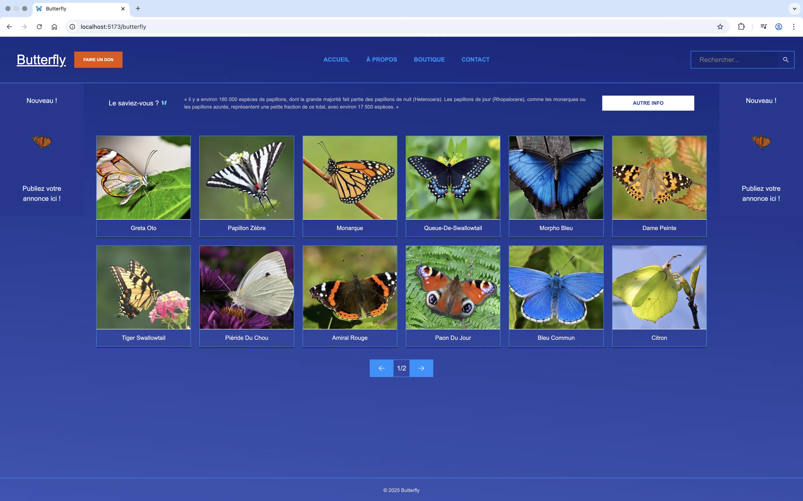

<p align="center">
  
</p>

---

# Butterfly

Bienvenue dans le projet **Butterfly** ! 🦋

**Butterfly** est une application web développée avec **React**, **Vite** et **TypeScript**, qui a pour but d'afficher des papillons sur une interface moderne et épurée. Le projet est structuré en composants React, ce qui permet une gestion claire et modulable du code. Côté design, j'ai choisi d'utiliser **SCSS** pour une gestion élégante des styles et des animations. 

Le projet inclut également une **barre de recherche** permettant aux utilisateurs de filtrer et de trouver facilement des papillons en fonction de leurs préférences.

---

## 🛠️ Technologies utilisées

- **React** : Une bibliothèque JavaScript populaire pour la construction d'interfaces utilisateur.
- **Vite** : Un outil moderne de développement front-end pour un démarrage rapide et une performance optimisée.
- **TypeScript** : Un sur-ensemble de JavaScript qui ajoute des types statiques pour rendre le code plus sûr et plus lisible.
- **SCSS** : Un préprocesseur CSS pour des styles modulaires et flexibles.

Le déploiement est automatisé grâce à GitHub Actions, et l'application est accessible à l'adresse suivante : 

<a href="https://elmahdik.github.io/butterfly/" target="_blank">Voir la démo</a>

---

## 🎨 Fonctionnalités

- Affichage de papillons animés dans une interface fluide.
- Structuré en composants React pour une meilleure organisation du code.
- Design soigné avec SCSS, permettant une personnalisation facile et une gestion efficace des styles.
- Utilisation de TypeScript pour garantir un code robuste et typé.
- **Barre de recherche** pour filtrer les papillons affichés selon des critères spécifiques.
- Performance optimisée grâce à Vite, pour une expérience utilisateur rapide et réactive.
- Responsive grâce aux media queries, offrant une expérience optimale sur tous les types d'écrans, qu'ils soient mobiles, tablettes ou ordinateurs.
---

## 🚀 Lancer le projet en local

Pour démarrer l'application en local, suivez ces étapes simples :

### 1. Clonez le projet

```bash
git clone https://github.com/ElmahdiK/butterfly.git
cd butterfly
```

### 2. Installez les dépendances

```bash
npm install
```

### 3. Démarrez le serveur de développement

```bash
npm run dev
```

L'application sera accessible à l'adresse suivante : http://localhost:5173

---

## ⚙️ Structure du projet

Le projet est organisé comme suit :

```bash
/butterfly
│
├── /public             # Images, animations, etc.
│
├── /src
│   ├── /components     # Composants React
│   ├── /styles         # Fichiers SCSS
│   ├── App.tsx         # Composant principal de l'application
│   └── main.tsx        # Point d'entrée TypeScript
│
├── index.html          # Fichier HTML principal
├── package.json        # Dépendances et scripts du projet
└── vite.config.ts      # Configuration de Vite avec TypeScript
```

---
## 💻 Contribuer

Les contributions sont les bienvenues ! Si vous avez des idées d'amélioration ou des corrections à proposer, n'hésitez pas à ouvrir une pull request. Assurez-vous de respecter les conventions de code et de tester vos modifications avant de soumettre.

---

## 📄 Licence
Ce projet est sous licence MIT. Voir le fichier LICENCE pour plus de détails.

---

## 📫 Contact

Pour toute question, suggestion ou autre, vous pouvez me contacter via les moyens suivants :

- **Email**: [elmahdi.korfed@gmail.com](mailto:elmahdi.korfed@gmail.com)
- **LinkedIn**: [https://www.linkedin.com/in/elmahdikorfed/](https://www.linkedin.com/in/elmahdikorfed/)


---

## 🌟 Acknowledgements
Un grand merci à la communauté React, Vite, et TypeScript pour leurs incroyables outils et à tous ceux qui ont contribué à ce projet !